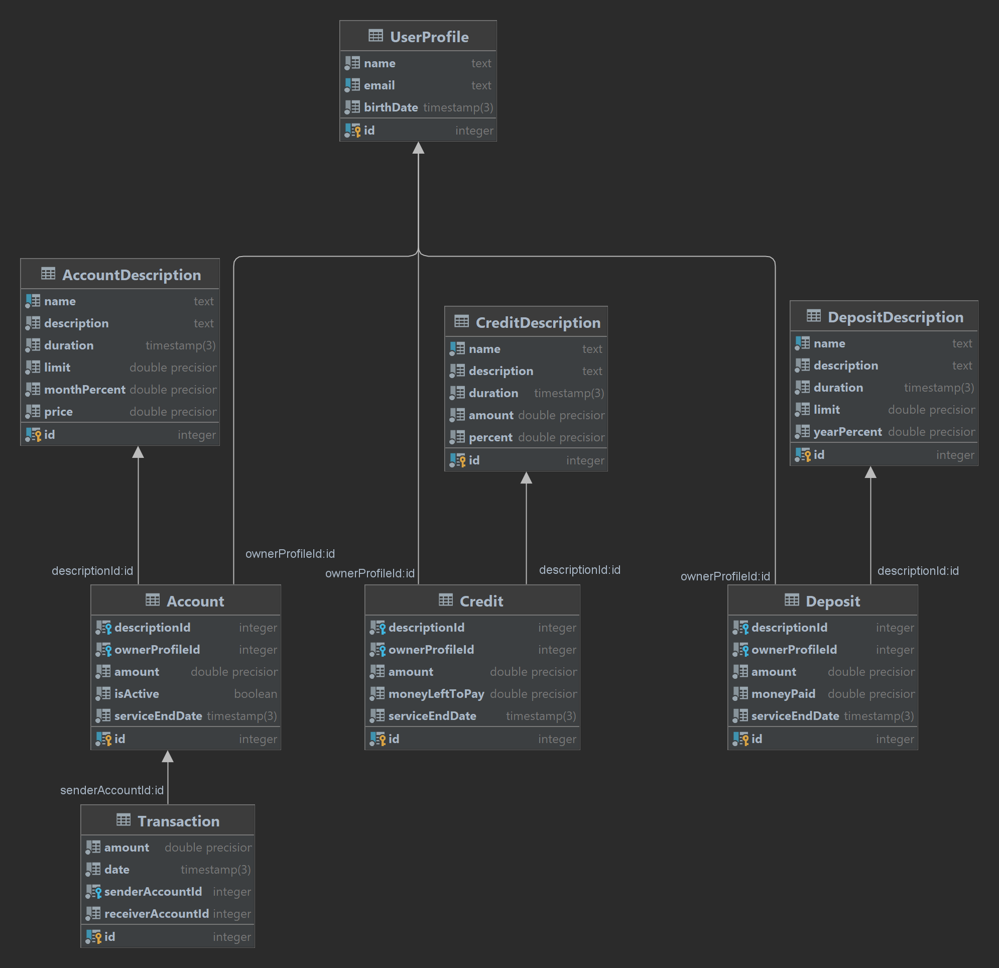

# Шевченко Валерий Владимирович M33001
## МиниБанк

### ERD диаграмма

Схемой предполагается три вида продуктов:

- Счёт **(Account)**
- Кредит **(Credit)**
- Вклад **(Deposit)**

Все три вида продуктов по мимо того, что имеют количество денег **(amount)** 
и дату окончания обслуживания **(serviceEndDate)**, 
ещё содержат специфичную для данного вида продуктов информацию:

- Для счёта - это флаг, активный ли это счёт **(isActive)**.
- Для кредита - это оставшаяся сумма, которую надо выплатить **(moneyLeftToPay)**.
- Для вклада - это выплаченная банком сумма к этому моменту **(moneyPaid)**.

Также, каждый из продуктов хранит индентификационный номер описания данного продукта **(descriptionId)**,
так как бывают разные условия для счётов, кредитов, вкладов:

- Описание счёта **(AccountDescription)**.
- Описание кредита **(CreditDescription)**.
- Описание вклада **(DepositDescription)**.

Все три вида описаний продуктов по мимо того, что имеют название продукта **(name)**,
текстовое описание **(description)** и длительность **(duration)**,
ещё содержат специфичную для данного вида описания продуктов информацию:

- Для описания счёта - это денежный предел, допустимый для хранения **(limit)**,
процент, начисляемый в конце месяца **(monthPercent)** и стоимость обсулижвания за месяц **(price)**.
- Для кредита - это сумма, на которую выдаётся кредит **(amount)**
и процент, на который выдаётся кредит **(percent)**.
- Для вклада - это денежный предел, допустимый для хранения **(limit)** и процент,
начисляемый в конце года **(yearPercent)**.

Каждый из продуктов имеет индентификационный номер профиля владельца **(ownerProfileId)**.

Профиль пользователя содержит следующую информацию:

- Имя пользователя **(name)**.
- Адрес электронной почты **(email)**.
- Дата рождения **(birthDate)**.

Перевод денежных средств в моём банке возможен только между счетами, 
поэтому транзакции **(Transaction)** содержат индентификационный номер 
счёта отправителя **(senderAccountId)** и 
индетификационный номер счёта получателя **(receiverAccountId)**.

Помимо этого имеется информацию о сумме перевода **(amount)** и дате перевода **(date)**.
